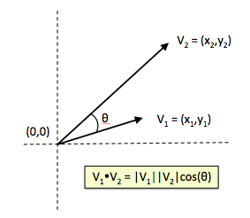

# Extra functionaliteit

Je hebt in de vorige opgaven al diverse ingebouwde opdrachten gezien die horen bij Python: `if` en `print` zijn twee voorbeelden. Er zijn nog heel veel andere *functies* bijgeleverd, maar die zijn niet standaard beschikbaar.

Voor het uitrekenen van de sinus van een getal is de functie `sin` beschikbaar. Maar als je nu meteen in Python `sin(1.0)` opvraagt, dan verschijnt er een foutmelding:

    Traceback (most recent call last):
      File "<stdin>", line 1, in <module>
    NameError: name 'sin' is not defined

Het gaat om de laatste regel van die foutmelding. Deze is in zo normaal mogelijk Engels geformuleerd en redelijk te begrijpen: Python kent de naam `sin` niet en kan er dus niks mee!

Om gebruik te maken van de `sin`-functie moet je zorgen dat de `math`-bibliotheek en alle functies daarin beschikbaar komen in jouw programma:

	import math			# importeer de wiskunde bibliotheek
	
	x = 0.5
	print math.sin(x)

Als je de functie `sin()` wilt gebruiken moet je altijd duidelijk aangeven in welke bibliotheek Python die functie moet vinden. Er zouden bijvoorbeeld alternatieve bibliotheken kunnen zijn waarin ook functies zoals `sin` staan. Wij moeten dus expliciet kiezen voor de `math`-bibliotheek.

## Documentatie

- De functies die beschikbaar zijn in de math library kan je vinden in de documentatie:

  <https://docs.python.org/2/library/math.html>

- En zo zijn er nog meer libraries die horen bij standaard-Python:

  <https://docs.python.org/2/library/>

- Voor elk vakgebied of toepassing is wel een aparte library te vinden. Zodra je zelf in je studie aan grotere programma's gaat werken, zal het misschien ook handig zijn om je eigen standaardcode in een library onder te brengen. Het komt de overzichtelijkheid ten goede en je kan je code zo ook makkelijk delen met andere mensen.

## arange

Een voorbeeld van een uitgebreidere wiskundebibliotheek is de `numpy`-library. Een overzicht, documentatie en voorbeelden kan je vinden op <http://www.numpy.org>. We noemen meteen een handige functie die we in deze cursus een paar keer zullen gebruiken: `arange`.

Van de `for`-loops ken je nog de opdracht `range`. Dit blijkt ook een functie te zijn, namelijk ééntje die reeksen opeenvolgende nummers genereert. Zo zijn deze twee stukken code equivalent:

    # versie 1
    for i in range(1,10):
        print i
    
    # versie 2
    for i in [1,2,3,4,5,6,7,8,9]:
        print i

Nu werkt deze `range`-functie alleen met gehele getallen. In wiskundige toepassingen willen we vaak veel kleinere stapjes nemen. Denk aan het berekenen van een integraal op kleine intervallen (daar gaan we in de volgende module mee aan de slag!). Met behulp van `numpy.arange()` kan dat net zo makkelijk als met gehele getallen:

    import numpy
    
    for x in numpy.arange(2.0, 9.0, 0.1):
        print x

# Opgave

Schrijf een programma **hoek.py** dat de hoek tussen 2 vectoren berekent in graden (en dus niet in radialen) en de uitkomst op het scherm print.

{:.inline}

Het inprodukt van 2 vectoren $$V_1$$ en $$V_2$$ ($$V_1 \cdot V_2$$) is te schrijven als het produkt van de lengtes van de vectoren en de cosinus van de openingshoek tussen de 2 vectoren:

$$ V_1 \cdot V_2 = |V_1|~|V_2|\cos(\theta)$$

In deze uitdrukking is $$V_1 \cdot V_2 = x_1x_2 + y_1y_2$$, $$\|V_i\|$$ de lengte van vector $$V_i$$ en $$\theta$$ de openingshoek in radialen.

Gebruik als vectoren $$V_1$$ = (2,5) en $$V_2$$ = (1,2) en zorg dat de output op het scherm weergegeven wordt als :

    De hoek tussen (2,5) en (1,2)  is <youw resultaat> graden.

Gebruik de functie `acos()` uit de `math`-bibliotheek.
