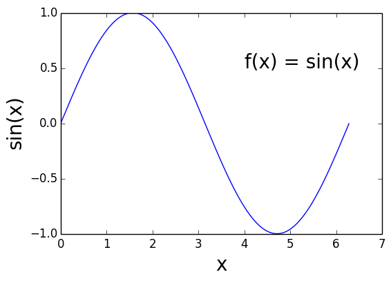

# Grafieken

Het is vaak handig om je resultaten te visualiseren in een grafiek of zelfs een filmpje. Dit is belangrijk om aan het eind van het project je resultaten inzichtelijk te maken, maar ook tijdens het ontwikkelen van (lees 'vechten met') je code. Tijdens het programmeren loop je vaak tegen problemen waarbij de computer niet lijkt te doen wat jij wilt. Dit zogenaamde debuggen, het uitzoeken waar je programa een andere lijn volgt dan de logica die jij erin denk te hebben gestopt, gebeurt vaak door op bepaalde plekken iets te printen. Een alternatief is het visualiseren van de data uit je programma, omdat je vaak in één oogopslag ziet waar het probleem zit.

Om je boodschap en conclusies goed over te brengen is het belangrijk dat je aandacht besteedt aan de presentatie zodat het voor je publiek duidelijk is. Vaak duurt het doorrekenen van het probleem zelf uren/dagen/weken. Neem dus altijd de tijd om de bijbehorende grafiek netjes en duidelijk te maken.

Er is een standaardpakket om resultaten te visualiseren in Python: `matplotlib`. Het is een zeer omvangrijk pakket waarvan we maar een fractie nodig zullen hebben. Een goede tutorial kan je hier vinden: <http://matplotlib.org/users/pyplot_tutorial.html>.

> Er bestaat een enorme variatie in de manier waarop data en resultaten gevisualiseerd worden. Denk altijd na hoe *jij* denkt dat je het best de informatie weer kan geven zodat de *gebruiker* de juiste conclusie trekt. Zoek vervolgens in de `matplotlib`-documentatie hoe je dat voor elkaar kunt krijgen.

Hieronder drie voorbeelden waarmee je de basiscommando's leert kennen. In de opgave eronder ga je die gebruiken. Vergeet niet de voorbeelden uit te proberen en op te slaan in **module1.py**!

## Een lijst met punten

We beginnen met het plotten van wat punten waarvan we de x-waardes (0,1,2,3,4,5) en de y-waardes (0,1,4,9,16,25) hebben. In dit geval is het precies de functie x-kwadraat, maar dat hoeft natuurlijk niet. Om daar een grafiek van te maken doen we het volgende:

    import matplotlib.pyplot
	
    # de coordinaten per punt
    x_coords = [0,1,2,3,4,5]
    y_coords = [0,1,4,9,16,25]
	
    # plot punten (y tegen x) met groene rondjes
    matplotlib.pyplot.plot(x_coords, y_coords, 'go')
    matplotlib.pyplot.show()

Hierbij is ervoor gekozen om de 'marker' (figuur waarmee elk elk punt weergegeven wordt) weer te geven als een groen rondje: het commando daarvoor is `'go'`. Als je een rode lijn had gewild had je voor `'r-'` kunnen kiezen. 

## Afkorting

Om veel schrijven te voorkomen kun je een lange modulenaam ook een kortere naam geven bij het importeren.

    # gebruik de afkorting 'plt'
    import matplotlib.pyplot as plt
	
    # de coordinaten per punt
    x_coords = [0,1,2,3,4,5]
    y_coords = [0,1,4,9,16,25]
	
    plt.plot(x_coords, y_coords, 'go')
    plt.show()

## Meerdere grafieken en bijschriften

En natuurlijk behoren de assen labels te hebben, kan je 2 verschillende grafieken in 1 plot zetten en kan je zelf tekst weergeven. Om ook de grafiek x^3 in de grafiek te zetten (met rode lijnen) doe je het volgende:

    import matplotlib.pyplot as plt
	
    x_es      = [0,1,2,3,4,5]
    x_squared = [0,1,4,9,16,25]
	x_cubed   = [0,1,8,27,64,125]
	
    # let op: grafiek met twee datasets!
	plt.plot(x_es, x_squared, 'go', x_es, x_cubed, 'r-')
	
	plt.xlabel('de x-ax is klein')
	plt.ylabel('de y-as ix groot', fontsize = 25)
    
	plt.text(1.00,100., "mijn eerste plotje", color = 'blue', fontsize = 20)
	plt.text(4.00,100., "$$x^3$$", color = 'red', fontsize = 20)
    
	plt.show()

## Stap 3: hoge resolutie grafieken

In stap 2 hebben we een klein aantal punten gekozen waarbij je de waardes 
zelf in moet vullen. De grafiek ziet er dan ook niet bepaald mooi uit. Je kan natuurlijk met de computer ook zelf x-waardes en bijbehorende y-waardes berekenen en in lijsten opslaan. Als we bijvoorbeeld de functie sin(x) willen plotten in stapjes van 0.01 tussen 0 en 2*pi dan knopen we de verschillende dingen die we dit blok geleerd hebben aan elkaar en doen we het volgende:

    import numpy as np               # numpy mdule: nodig voor arange-functie
    import math                      # math module: nodig voor sin()-functie
    import matplotlib.pyplot as plt  # pyplot module: nodig voor plotten

    L_x = []   # lijst met x-waardes
    L_y = []   # lijst met y-waardes

    # x loopt van 0 tot 2pi in stapjes van 0.01
    for x in np.arange(0, 2*math.pi, 0.01):
        # bereken bijbehorende y-waarde voor elke x
    	y = math.sin(x)
        
        # voeg data toe aan de lijsten
    	L_x.append(x)
    	L_y.append(y)
    
    # teken de hele grafiek
    plt.plot(x_coords, y_coords, 'b-')
    plt.xlabel('x', fontsize = 20)
    plt.ylabel('sin(x)', fontsize = 20)
    plt.text(4.00, 0.50, "f(x) = sin(x)", color = 'black', fontsize = 20)
    plt.show()

# Opgave

1. Maak nu zelf een programma **grafiek.py** met een grafiek van de functie $$f(x) = x^x$$ tussen x = 0 en x=1.5 stapjes van 0.01. Gebruik hiervoor een blauwe lijn.

2. Zorg vervolgens dat je aan het eind van het berekenen van alle punten weet bij welke x-waarde de functie zijn minimum bereikt. Teken dat minimum met behulp van een rode stip in de grafiek en print de waarde van het minimum aan het eind van je programma. Als extra kun je ook proberen de waarde van het punt in de grafiek zelf te zetten.

3. Je bent niet voor niks natuurkundige naturlijk: bereken dit punt ook analytisch met behulp van pen en papier, om je antwoord te verifiëren.

