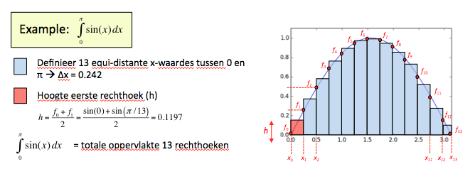

# Numeriek integreren met Riemann

Een van de manieren om een integraal te evalueren is door het te schrijven als de som van kleine rechthoekjes, de Riemannsom.

## Inleveren

Werk alles van vandaag uit in één Python-bestand genaamd **riemann.py**.

### a) Het probleem: 
Gegeven $$f(x)$$ op $$a \leq x \leq b$$, bereken $$\int_a^b f(x)~dx$$

### b) De oplossingsstrategie

Zorg eerst dat je de functie begrijpt door een plot te maken (zeker belangrijk bij ingewikkelder functies!). Deze hoef je niet in te leveren.

Algemeen: verdeel het interval $$(a,b)$$ in $$N$$ intervallen van gelijke lengte $$\Delta x$$ en schrijf de integraal als de som van de deel-integralen op elk van deze intervallen:

$$ \int_a^b f(x)~dx = \sum_{i=0}^{N-1} \int_{x_i}^{x_{i+1}} f(x)~dx$$

Hierbij is $$x_i$$ het hoekpunt van een van de intervallen. Er zijn $$N+1$$ hoekpunten die lopen van $$x_0$$ tot en met $$x_{N}$$.

### c) Benadering hoogte elk rechthoek mbv de trapeziumregel en uitwerking integraal

Benader nu de deel-integralen in elk van de subsecties door het voor te stellen als een rechthoek. De breedte van de rechthoek is natuurlijk 
$$\Delta x = (x_{i+1} - x_{i})$$. Een (simpele) schatting van de hoogte van het rechthoek dat het best de integraal op dit kleine interval weergeeft is simpelweg het gemiddelde te nemen van de waarde van $$f(x)$$ op de linkerkant en de rechterkant van het interval. De integraal op het deelinterval is dan te schrijven als:

$$\int_{x_i}^{x_{i+1}} f(x)~dx = \frac{f_{i+1}+f_i}{2}~\Delta x$$

De volledige integraal is dan te schrijven als (werk dit ook zelf uit op papier):

$$\int_a^b f(x)~dx = \frac{\Delta x}{2} (f_0 + 2 f_1 + 2 f_2 + ... +  2 f_{N-1} + f_N)~+~\mathcal{O}((\Delta x)^2)\\
                       ~~ \approx \Delta~x(f_1 + f_2 + ... +  f_{N-1}) ~+~ \frac{\Delta x}{2}(f_0+f_N) $$

### d) Implementatie in Python 
Zoals je ziet het je 'alleen' de waarde van de functie nodig op de $$N+1$$ hoekpunten van de intervallen. Zorg dat je het aantal intervallen $$(N)$$ in je programma vrij kan veranderen en bepaal aan de hand daarvan de hoekpunten $$x_i$$ en de waarde van de grafiek op elk van die hoekpunten $$f(x_i)$$. Bereken aan het eind van het programma de integraal en print het op het scherm.

## Voorbeeld:

In de evaluatie van de integraal $$\int_{0}^{\pi}sin(x)~dx$$ hebben we het integratiegebied in $$x$$ opgedeeld in 13 gebieden van gelijke grootte. We hebben dan dus in totaal 14 x-waardes. De hoogte van elk vcan de 13 rechthoeken is het gemiddelde van de waarde aan de linkerkant en de rechterkant van het kleine integratiegebied. De uiteindelijke integraal kunnen we evalueren door de oppervlaktes van alle rechthoeken op te tellen. Let op, kan iets slimmer mbv de bovenstaande formule. Zodra dit werkt kan je natuurlijk de rechthoekjes steeds kleiner maken en in plaats van 13 1000 gebieden definieren.

## Tips:

  - Maak altijd een plaatje van je grafiek zodat je duidelijk ziet welk gebied je aan het integreren bent.

  - test je programma altijd op een (vergelijkbare) integraal die je wel analytisch kan uitrekenen. 

  - specifiek voor Riemannnsom: Als je het interval in $$N$$ stukjes verdeeld zijn er $$N+1$$ hoekpunten.

## Opgaven

- $$\int_{0}^{1}x^{x+\frac{1}{2}} ~dx$$

Hint: test je functie door te testen of je programma de integraal $$\int_{0}^{1}x^2 dx$$ goed voorspelt

- $$\int_{0.2}^{2.2} \tan(\cos(\sin(x))) ~dx$$

Hint: test je functie door te testen of je programma de integraal $$\int_{0}^{\pi}sin(x) dx$$ goed voorspelt

- $$\int_{0}^{\pi} \sin(x^2) ~dx$$

## Sanity check

Let op dat je alleen de volgende Python-onderdelen hebt gebruikt in je oplossingen:

- alle onderdelen van module 1
- `random.random()`
- `math.pow()`
- `math.pi`
- `def`
- `return`
- `elif` (find out what you can do with that!)

Let op! Andere functies van `math` en `numpy` mag je (nog) niet gebruiken!
