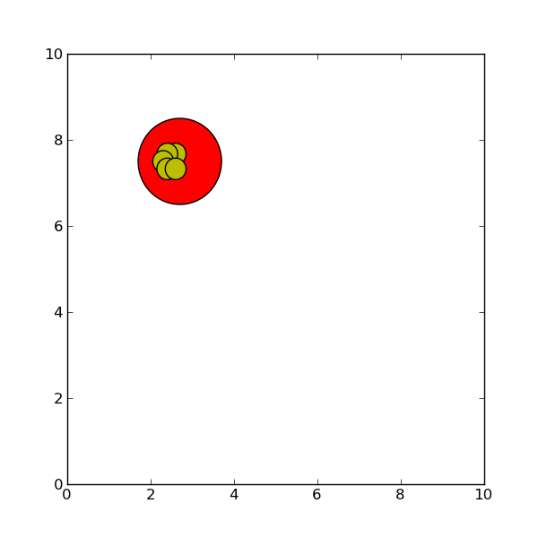

# Doel en opzet van Module 3

Hoe doel van Module 3 bestaat uit 2 delen:

  - het simuleren van een natuurkundig proces 
  - het analyseren van een meting en een data-set
  

# Data visualisatie: meerdere grafieken tegelijk
   
We gkunnen maar een zeer klein aantal mogelijkheden laten zien die Matplotlib 
ons biedt om data tevisualiseren. Als laatste item zullen we kijken hoe we 2 
grafieken naast elkaar kunnen tekenen. In de opgaves van de rest van deze modules 
zullen we dit ook morgen zullen we dit ook gebruiken op het moment dat er gevraagd 
wordt zowel de snelheid als de positie van een object te tekenen als functie van 
de tijd.

Het kernwoord in het teken van meerdere figuren is `subplot`. Als voorbeeld proberen 
we in een linker grafiek zowel de cosinus als de sinus weer te geven en in een grafiek 
ernaast tekenen we, voor hetzelfde gebied in *x* de grafiek $$x^2$$.

De code die we hiervoor gebruiken is als volgt:

    import math
    import numpy as np
    import matplotlib.pyplot as plt

    L_x    = []
    L_x2   = []
    L_sinx = []
    L_cosx = []

    for x in np.arange(0.,2*math.pi,0.01):
        L_x.append(x)
        L_x2.append(x*x)
        L_sinx.append(math.sin(x))
        L_cosx.append(math.cos(x))

    #--/ gemeenschappelijke figuur (bevat beide sub-figuren)
    plt.figure(1)

    plt.subplot(121)  # ga naar subplot 1
    plt.plot(L_x, L_sinx, 'b-',L_x, L_cosx, 'r--')

    plt.subplot(122)  # ga naar subplot 2
    plt.plot(L_x, L_x2, 'g-')

    #--/ teken beide grafieken op het scherm
    plt.show()
    
    
    
    
# Animaties

Hoe Sommige zaken zijn niet makkelijkvoor te stellen 

