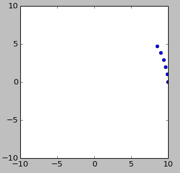

# Animation

Hoewel een grafiek zeer inzichtelijk kan zijn om een proces te simuleren is niks 
inzichtelijker een animatie te maken. Python biedt je de mogelijkheid om een 
figuur steeds opnieuw te tekenen. Dat geeft je verschillende mogelijkheden.

### Voorbeeld: bewegend punt (2x)
Als je een punt tekent (1 x-waarde en 1 y-waarde) waarvan je x en y steeds verandert 
dan lijkt het of het punt over het scherm beweegt. In de code hieronder nemen we 
steeds stapjes in x en laten we 2 punten over het scherm bewegen via de functies 
$$f_1(x) = sin(x)$$ (blauwe punt) en $$ f_3(x) = 0$$ (groene punt).

### Voorbeeld: bewegende lijn
Een grafiek tekenen we met behulp van lijsten: een lijst met x-waardes en een lijst 
met y-waardes. Als je die lijsten steeds uitbreidt dan krijg je het onderstaande 
effect: de functie $$f_2(x) = \frac{1}{2}cos(5x) $$ getekend met een rode lijn.

    import math
    import matplotlib.pyplot as plt

    L_x  = []   # list of x-values
    L_y2 = []   # list of y-values for 1 of the functions

    #--/ kleine stapjes in x
    for x in np.arange(0,math.pi,0.02):

        y1 = math.sin(x)
        y2 = 0.5 * math.cos(5*x)
        y3 = 0
        
        L_x.append(x)
        L_y2.append(y2)

        #--/ plot graphs
        plt.plot(x, y1, 'bo', markersize = 10)            # sin(x), blauwe punt
        plt.plot(L_x, L_y2, 'r-', lw=2, markersize = 15)  #   f(x), rode lijn
        plt.plot(x, y3, 'go')                             #      0, groene punt

        plt.xlim(0,math.pi)
        plt.ylim(-1,1)
        plt.draw()      # Update graph
        plt.pause(0.001)
        plt.clf()       # Clear graph (important)

Hier het uiteindelijke resultaat:

## Opgave 1: animatie van spiraliserende stip

Een balletje draait met een bepaalde hoeksnelheid rond en met elke stap in de tijd 
verandert niet alleen de hoek, maar wordt ook de straal steeds kleiner tot hij 
uiteindelijk precies in het midden stilstaat

Op elk moment wordt een punt beschreven door 2 coordinaten (x,y), maar je kan ook 2 
andere variabelen gebruiken ($$\alpha$$,R), waarbij $$\alpha$$ de hoek is met de 
positieve x-as en R de afstand tot de oorsprong. De variabelen kunnen in elkaar omgeschreven 
worden zoals in de grafiek is aangegeven.

Details voor de animatie: 
   - $$\alpha$$ varieert van 0 tot 20 in stappen van 0.1
   - R hangt af van $$\alpha$$, nl: $$R=10-0.5\alpha$$ 

## Opgave 2: dronken studenten

Een dronken student (die natuurlijk geen natuurkunde studeert, want dan lag hij keurig 
vroeg in bed) neemt elke seconde een stap. De grootte van de stap is steeds hetzelfde 
(R = 1), maar de richting waarin hij die stap neemt is volledig random. Kies bij elke 
stap in de tijd een random hoek $$\alpha$$ en bepaald vervolgens de nieuwe x-positie en 
y-positie. Hieronder zie je de student als blauwe stip en het ook het pad dat hij gevolgd 
heeft. Dit staat bekend als een *random walk*.

Als 2 studenten dronken zijn en ze elkaar uit het oog verliezen wordt het erg onwaarschijnlijk 
dat ze elkaar nog terugvinden. Probeer de volgende animatie na te maken waarin je de beide studenten 
ziet lopen. Laat op het scherm ook zien hoe lang de kijken nog moet wachten tot het programma 
afgelopen is.

Probeer ook eens of je (met en en papier) iets kan zeggen over de gemiddelde afstand die de 
studenten van elkaar verwijderd zijn als functie van het aantal stappen dat ze nemen.

Filmpje opslaan ? Probeer GifGrabber (app) te gebruiken om een animated gif te maken. Die kan je weer in een webbrowser bekijken.

