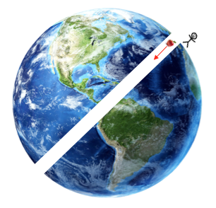

# Simulaties

# Opgave 1: appel valt van de Dom in Utrecht

Schrijf een programma `VallendeAppel.py` dat de beweging van de appel beschrijft als die op een hoogte van 100 meter wordt losgelaten.

Zorg dat je programma kleine stapjes in de tijd maakt (0.01 seconden bijv) en hou steeds bij op welke hoogte de appel zich bevindt (*x*) en met welke snelheid hij beweegt (*v*. 

Bereken voor elke nieuw stapje in de tijd

  a) de kracht die er op de appel werkt  
  b) de versnelling die de appel zal ondervinden als gevolg van die kracht
  c) de nieuwe snelheid die de appel daardoor krijgt
  d) de nieuwe positie van de appel

Je hebt dan een nieuwe positie en snelheid gekregen en je kan vervolgens een stapje in de tijd maken en deze cyclus herhalen.

### opdracht 1a) Laat je programma printen na hoeveel seconden de appel de gron raakt.

### opdracht 1b) Laat je programma printen met welke snelheid hij de grond raakt.

### opdracht 1c) Laat je programma printen na hoeveel seconden de appel een snelheid van 100 km/uur heeft behaald. Is een vallende appel eerder bij 100 km/uur dan een Formule 1 auto of niet ?

# Opgave 2: vrije val van base jumpers

# Opgave 3: de ultieme free-fall

