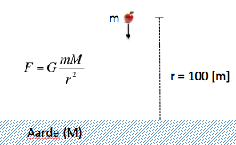

# Opdracht: een appel valt van de Dom

Schrijf een programma **appel.py** dat de beweging van de appel beschrijft als
die op een hoogte van 100 meter wordt losgelaten.

Zorg dat je programma kleine stapjes in de tijd maakt ($$\Delta t=0.01$$
seconden) en hou steeds bij op welke hoogte de appel zich bevindt ($$x$$) en met
welke snelheid hij beweegt ($$v$$).

Bereken voor elke nieuw stapje in de tijd en in deze volgorde:

1. de kracht die op de appel werkt (F)
2. de versnelling die de appel daardoor krijgt (a)
3. de nieuwe snelheid die de appel daardoor krijgt (v)
    gebruik: $$v_{\rm nieuw} = v + a \Delta t$$
4. de nieuwe positie van de appel (x). 
    gebruik: $$x_{\rm nieuw} = x + v \Delta t$$

Je hebt dan een nieuwe positie en snelheid gekregen en je kan vervolgens een stapje in de tijd maken en deze cyclus herhalen.

## Uitvoer

Zorg dat de volgende resultaten geprint worden door je programma:

1. Na hoeveel seconden raakt de appel de grond?

2. Met welke snelheid (km/uur) raakt de appel de grond?

3. Na hoeveel seconden heeft de appel een snelheid van 100 km/uur bereikt? Is
    een vallende appel daarmee sneller dan Bugatti Veyron (2.46 seconden) of niet?

De uitvoer moet heel precies zijn en alleen de gevraagde waarden bevatten. Bijvoorbeeld zo:

	000 s
	000.0 km/uur
	0.00 s

## Tips

- Gebruik bovenstaande formule en start de appel dus op x = $${\rm R_{earth}}$$ + 100 meter. Als je wilt weten hoe hoog de appel is, de grootheid die je iets zegt en die je ook in de plots gebruikt, gebruik dan h = x - $${\rm R_{earth}}$$.
- Let goed op het teken van de krachten en snelheden. je begint bij positieve $$x$$ en beweegt dan naar $$x=0$$ toe.
- In dit voorbeeld kan je de antwoorden ook zelf uitrekenen met behulp van pen en papier.
- Bereken alles eerst in m/s en reken dan voor punt 2 de snelheid om naar km/uur.
