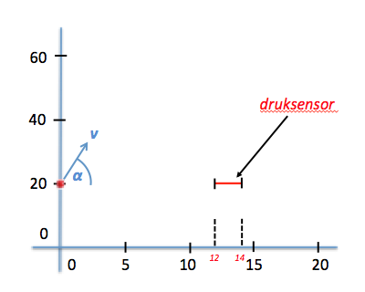

# Opgave 4: Angry Birds

We bekijken een situatie zoals in het plaatje hieronder getekend waarbij 
een object wordt weggeschoten vanaf de positie (x=0, y=20) met snelheid 
$$v$$ onder een hoek ($$\alpha$$). Net als in de vorige opgaves zal de kogel 
onder invloed van de zwaartekracht gaan bewegen.

Als de bal de grond raakt zal hij terugstuiteren en weer omhoog bewegen. In 
het probleem is ook een druksensor aanwezig dat reageert op een contact met 
een object. De druksensor bevindt zich op een hoogte $$y_{sensor}=20$$ en 
strekt zich uit van $$10 < x_{sensor} < 20$$. 

Schrijf een programma `AngryBirds.py` die bestudeert welke hoeken zorgen 
dat de weggeschoten kogel de druksensor zal raken (van boven of van onder)
als het met een snelheid $$v=16$$ [m/s] wordt weggeschoten. Varieer hierbij 
de hoek $\alpha$ tussen -88 en +88 graden in stappen van 1 graad en maak 
een grafiek waarin duidelijk wordt welke hoeken wel/niet voor een contact 
met de druksensor zorgen.
 
Probeer ook deze opdracht in kleine stapjes aan te pakken:

   - Maak eerst een functie dat de beweging van het kogeltje laat zien 
     op het scherm met behulp van een animatie. Zorg dat deze functie 
     als inputparameter de hoek waaronder de kogel weggeschoten mee krijgt.

   - zorg dat je bij aanroep van de functie kan kiezen of de animatie 
     wel/niet op het scherm getekend wordt. Dat tekenen duurt erg lang 
     en wil je niet altijd doen.

   - bepaal of je kan bepalen of de kogel door de lijn y=20 heengaat 
     ergens tussen x=12 en x=14.

   - zorg dat de functie een return-value geeft die weergeeft of de kogel 
     wel/niet door het gat is gegaan.
   
   - varieer in een nieuw stuk programma de hoeken, roep de functie steeds 
     aan en maak een grafiek waarbij duidelijk wordt welke hoeken wel/niet 
     zorgen dat de kogel door het gat gaat

## Extra (optioneel):

De standaard manier om de positie van de kogel te tekenen die we in deze cursus 
geleerd hebben is de volgende:

    plt.plot(x_kogel, y_kogel, 'bo')  

Het is natuurlijk veel leuker om in plaats van een stipje een plaatje van een 
vogel te laten rondvliegen. Je hebt daar de volgende constructie voor nodig. 
Het stuk `plt.imshow` tekent het plaatje op het scherm. Je moet hierbij duidelijk 
het gebied aangeven waar het plaatje afgebeeld wordt. Hier is gekozen als 
positie die van de kogel en een afmeting van 0.5 in x en 2.0 in y respectievelijk.

    import matplotlib.image as image

    im = image.imread('/Users/ivo/Desktop/AngryBirdsLogo.png')
    plt.imshow(im, aspect='auto', extent=(x_kogel, x_kogel+0.5, y_kogel, y_kogel+2), zorder=-1)

