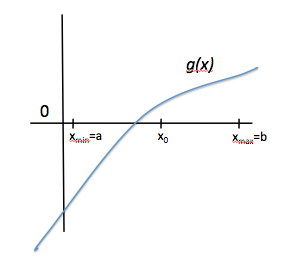

# Bisectie: iteratief een nulpunt vinden

Een bekend probleem is het vinden van een nulpunt van een grafiek (of een plek waar 2 grafieken aan elkaar gelijk zijn). Als je bijvoorbeeld het nulpunt wilt vinden van de grafiek $$f(x)=x^3-2x^25x-3$$ dan kan je tussen -5 en 5 stapjes gaan maken en kijken of een van de y-waardes 0 (af een andere specifieke y-waarde heeft) is. Met zo'n strategie zal je nooit 'precies' de nulpunten vinden en het is erg inefficient. Iets abstracter geldt dit ook voor het meer algemene geval dat $$f(x)=g(x)$$. 

Er is een procedure die je met een paar iteraties vrij snel naar het goede antwoord toe zal leiden: de bisectie-methode.

### Probleem: bepaal oplossing $$x_0$$ voor $$f(x_0)=y$$
Gegeven $$f(x)$$ met 1 ($$\rm{  \'{e}\'{e}n } $$) oplossing voor $$f(x)=y$$ op $$a \leq x \leq b$$

### Oplossing: bepaal nulpunt $$x_0$$ van $$g(x) = f(x)-y$$

Als je de functie herschrijft, $$g(x) = f(x)-y$$, dan vertaalt het probleem zich in het vinden van het nulpunt van g(x) op het gebied $$a \leq x \leq b$$. Er geldt dus nu dat $$f(a)f(b)<0$$, want als $$f(a)<0$$ dan $$f(b)>0$$ en andersom. 

We starten met  de veilige gok dat het nulpunt $$x_0$$  ergens ligt tussen $$x_{\rm links} = a$$ en $$x_{\rm rechts} = b$$ en nemen dan steeds de volgende stappen:

  - Definieer $$x_0=\frac{1}{2}(x_{\rm links}+x_{\rm rechts})$$.
    Gok dus dat het nulpunt precies tussen $$x_{\rm links}$$ en $$x_{\rm rechts} ligt.
    
  - Bepaal $$g(x_0)$$. Ligt het dus boven de lijn of onder de lijn ?
    o Als $$g(x_0)>0$$ dan ligt het nulpunt dus links van deze gok voor $$x_0$$.
      Als $$g(x_0)>0$$ vervang $$x_{\rm rechts}$$ door $$x_0$$ en hou $$x_{\rm links}$$ hetzelfde.
    o Als $$g(x_0)<0$$ dan ligt het nulpunt dus rechts van deze gok voor $$x_0$$.
      Als $$g(x_0)<0$$ vervang $$x_{\rm links}$$ door $$x_0$$ en hou $$x_{\rm rechtss}$$ hetzelfde.

  - Als dit klaar is begin je opnieuw.

Er zijn snellers methodes om te convergeren, maar dat is nu niet belangrijk.

