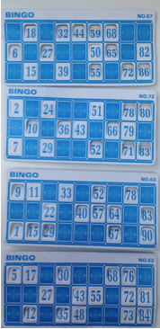

# Bingo

Op vakantie spelen 4 kinderen een potje bingo. In het spel zijn 90 balletjes met de getallen 1 t/m 90. Elke speler krijgt een bingokaart met 15 getallen en er wordt steeds 1 balletje uit de pot gehaald. Wie het eerst al zijn getallen 'vol' heeft heeft gewonnen.

Tijdens een van de spelletjes waren er nog 7 balletjes over toen de eerste persoon bingo had (er waren dus toen 83 balletjes getrokken). Dat lijkt vrij bijzonder. De vraag is nu: hoe bijzonder is dit ?

Concreet: gebruik dezelfde 4 bingo kaarten, maar simuleer steeds een nieuw potje bingo en kijk hoeveel balletjes er getrokken moeten worden voor de eerste persoon bingo heeft. Doe dit een groot aantal keer en bekijk welke fractie bingo spelletjes pas is afgelopen als er 83 balletjes (of meer) zijn getrokken.

### Let op:

   - Je mag de volgende syntax gebruiken om een element *i* uit een lijst te halen/l `del L_getallen[i]`.
     Voorbeeld   
     [1]> L_getallen = [990,34,12,56] 
     [2]> del L_getallen = [2] 
     [3]> print L_getallen
     >> L_getallen = [990,34,56] 

