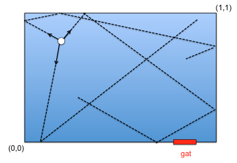

# Deeltjes in een doos

In een doos (afmeting $$0\leq x \leq 1$$ en $$0\leq y \leq 1$$) worden op een plek $$(x_{\r source},y_{\r source}) = (0,25,0,75)$$ een aantal deeltjes geproduceerd met een random snelheid en richting. Voor elk deeltje $$i$$ geldt dus:

   - snelheid($$v_i$$):  $$0<v_i<0.10$$

   - hoek ($$\alpha_i$$):  $$0<\alpha_i<2\pi$$

Het is met behulp van de computer mogelijk de positie van een groot aantal deeltjes in de tijd te volgen. In het begin van de opgave zullen we de natuurkunde een beetje moeten versimpelen, maar het zal ons toch in staat stellen een aantal fenomenen te onderzoeken.

Aannames (deel 1 opgave)

   - de deeltjes ketsen elastisch tegen de wanden en kunnen de doos niet uit

   - de deeltjes hebben geen afmeting en kunnen niet botsen
   
Genereer een beginsituatie door voor een groot aantal punten $$i$$ de snelheid $$v_i$$ en $$\alpha_i$$ te kiezen. 

## Inzicht aan het begin van de opgave:
   - De evolutie in $$x$$ en $$y$$ is afzonderlijk te beschrijven.

   - Bepaal gelijk aan het begin voor elk deeltje zijn snelheid in x en y afzonderlijk. Die snelheden zullen namelijk nooit meer veranderen. Ket op: het teken van de snelheid kan wel veranderen als het deeltje tegen een wand opbotst.
   
   - Hou van elk deeltje op elk tijdstip *alleen* zijn positie (x,y) en zijn snelheid (vx, vy) bij. Je hoeft dat dus niet te doen als functie van de tijd. Dat is alleen nodig als je een baan van een deeltje zou willen plotten op het scherm.

